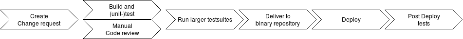
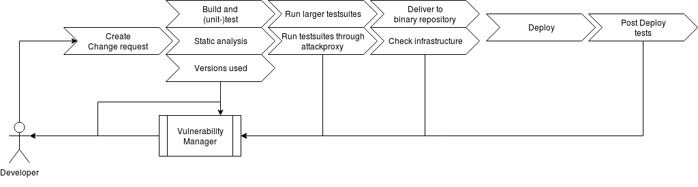
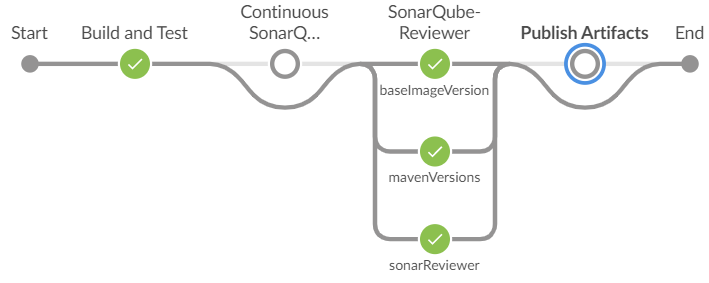
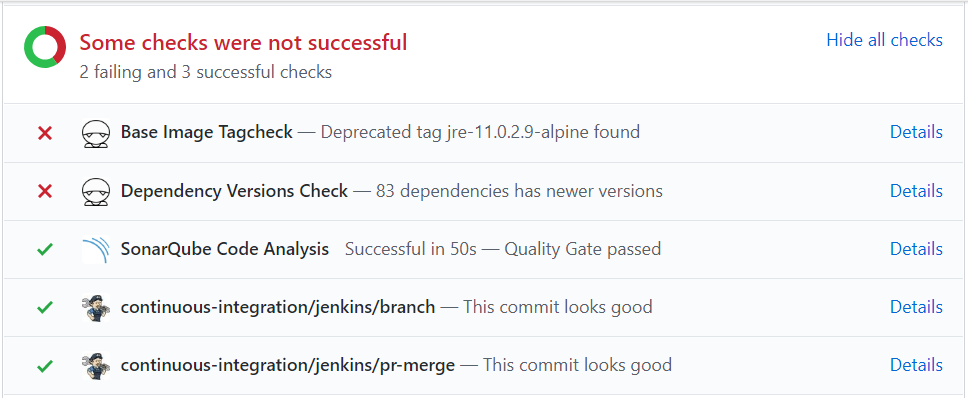
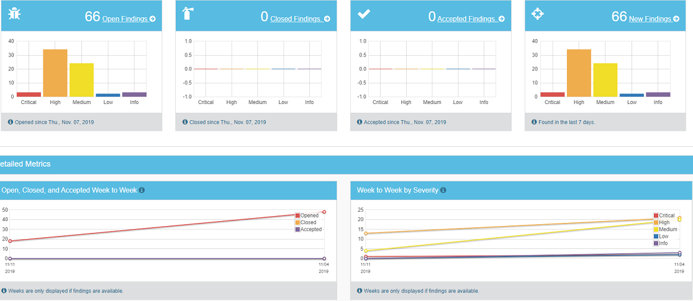

<!-- .slide: data-background="./gfx/front_bg.png" -->
## Automating security with CI/CD 

---
<!-- .slide: data-background="./gfx/front_bg.png" -->
## Martin Vesterlund
* Consultant @ Cybercom
* Master of Science in computer security
* Like to break things
* Work with infrastructure and support for enabling CI/CD and DevOps

---
<!-- .slide: data-background="./gfx/front_bg.png" -->
## CI/CD - quick walkthrough

Note: * Code review (Pull/change-request)
* Build and (unit-) test change 
* Delivery: publish built artifacts to repository
* Deploy: publish built artifacts to running environment

----
<!-- .slide: data-background="./gfx/front_bg.png" -->
## Built-in security features
* Audit-trail
* Immutable artifacts 
* Repeatable

----
<!-- .slide: data-background="./gfx/front_bg.png" -->
## Automate the repetative stuff
### Like security checks

---
<!-- .slide: data-background="./gfx/front_bg.png" -->
## But why security tests in CI/CD-pipelines?
### Find and fix the low hanging fruit

Note: * Find issues early and fix them early
* Keep in pace with development
* Help the pentesters

---
<!-- .slide: data-background="./gfx/front_bg.png" -->
## Static analysis can find bad patterns
### Like injection vectors and use of insecure functions

Note: * SQL, XSS, Command injection, hardcoded credentials, bad crypto
* Potential buffert overflows etc
* Highly dependent on language and automation platform
* SonarQube is good, but PR-analysis only available when paid
* SpotBugs, PumaScan, GoSec
* Can be hard to fix and harder to measure criticality
----
<!-- .slide: data-background="./gfx/front_bg.png" -->
## A9/CWE-937: Using Components with Known Vulnerabilities
### Use tools to check your dependencies for reported vulnerabilities

Note: * Dependent on language, framework, dependencymanagement and build-system
* Owasp DependencyCheck and Dependencytrack cover most cases
* npm Audit
* Scan docker images: Clair, Anchore, Actuary
* Or tell developers when there are new versions available as a build check
* Often easy to fix without any fuzz, can be really hard to measure how critical it is
---
<!-- .slide: data-background="./gfx/front_bg.png" -->
## Dynamic testing
### Security tests is not that hard

----
<!-- .slide: data-background="./gfx/front_bg.png" -->
## Unit-tests
### Test your boundaries and input handling

Note: * Security features are features
* How does the code handle certain input
* How does it handle exremely large input
* Integer overflow/underflow
* OWASP Testing Guide and Application Security Verification Standard
----
<!-- .slide: data-background="./gfx/front_bg.png" -->
## But, you must know how to hack to write security tests
### Or do you?

----
<!-- .slide: data-background="./gfx/front_bg.png" -->
## Most attackers will use attack-proxies
### So should you!

Note: * A proxy that analyses and manipulates the requests passed through it
* OWASP ZAP
* BurpSuite
----
<!-- .slide: data-background="./gfx/front_bg.png" -->
## Run your API-, E2E- and UI-tests through an attack-proxy

Note: * Can provide valuable findings such as insecure cookies
* It will replay the traffic and manipulate the requests and look at the responses
* If findings from static analysis is exploitable
* Requires some setup, but the tools does not require any security knowledge
* You might break things though
----
<!-- .slide: data-background="./gfx/front_bg.png" -->
## Add testcases from penetrationtests
### Provides regression testing

Note: * ZAP can be scripted, i.e. results from an penetration test can be added to provide regression testing
* BDD-Security
---
<!-- .slide: data-background="./gfx/front_bg.png" -->
## The full chain

Note: * Pre-merge: static analysis, unit-tests and code-review
* Post-merge: run integration-tests isolated with attack-proxies
* Deploy to test-environment: run acceptance and E2E-tests with attack-proxy
* Deliver to production
----
<!-- .slide: data-background="./gfx/front_bg.png" -->
## What if we could test the infrastructure before and after deploy?

----
<!-- .slide: data-background="./gfx/front_bg.png" -->
## Run local configuration checks on the target
### File permissions, sudo access, installed packages etc.

Note: * OpenSCAP can be used
* A lot of tools available, or possible to create own
----
<!-- .slide: data-background="./gfx/front_bg.png" -->
## Run remote tests
### It's your acceptance-test with some added nastyness

Note: * GaunTLT + BDD-Security
* Check open ports
* Check TLS-configuration
* Nessus/OpenVAS
----
<!-- .slide: data-background="./gfx/front_bg.png" -->
## Infrastructure as code
### Code should be tested and analysed before deploy

Note: * Do the running configuration differ from the expected?
* Firewall rules
* Routing tables
* Machine settings
* System monitoring
----
<!-- .slide: data-background="./gfx/front_bg.png" -->
## Reporting
### On change requests (pre-merge)
### and in dedicated platform (post-merge)

Note: * OWASP Defectdojo
* SonarQube
* Integrate with issue-tracking and error-reporting
* Issues that needs planning to fix
* Provides possibility to analyse trends etc
---
<!-- .slide: data-background="./gfx/front_bg.png" -->
## How do we make the developers use this?

----
<!-- .slide: data-background="./gfx/front_bg.png" -->
## We sneak it in...
```groovy
library 'stable'
pipeline {
//...
  stage('Persisted Static Analysis') {
    steps {
      runPersistedSonarAnalysis()
    }
  }
  stage('PullRequest static Analysis') {
    steps {
      pullRequestStaticAnalysisChecks()
    }
  }
//...
}
```

Note: * These steps expands into various actions like dependency-check, sonar-analysis and reporting
* Since we control the shared library we can add and change the steps

----
<!-- .slide: data-background="./gfx/front_bg.png" -->
## And suddenly it looks like this


----
<!-- .slide: data-background="./gfx/front_bg.png" -->
## It's hard to ignore 

Note: * When faced with this, it's hard to ignore and forget it
* Requires action and reason to not fix
----
## And management get graphs

---
<!-- .slide: data-background="./gfx/end_bg.png" -->
## Thank you
### martin.vesterlund@cybercom.com
### [https://www.linkedin.com/in/martin-v-b2a51558](https://www.linkedin.com/in/martin-v-b2a51558)
---
<!-- .slide: data-background="./gfx/front_bg.png" -->
## Resources
* [SonarQube](https://www.sonarqube.org), [SpotBugs](https://spotbugs.github.io/), [find-sec-bugs](https://find-sec-bugs.github.io/), [PumaScan](https://github.com/pumasecurity/puma-scan), [GoSec](https://github.com/securego/gosec)
* [DependencyCheck](https://github.com/jeremylong/DependencyCheck), [DependencyTrack](https://github.com/DependencyTrack/dependency-track), [npm Audit](https://docs.npmjs.com/cli/audit), [Clair](https://github.com/coreos/clair), [Anchore](https://anchore.com/opensource/), [Actuary](https://github.com/diogomonica/actuary)
* [OWASP ZAP](https://www.zaproxy.org/), [BurpSuite](https://portswigger.net/burp)
* [BDD-Security](https://iriusrisk.com/open-source/), [Gauntlt](http://gauntlt.org/)
* [OpenSCAP](https://www.open-scap.org/tools/), [OpenVAS](http://openvas.org/)
* [OWASP DefectDojo](https://github.com/DefectDojo/django-DefectDojo)
* [OWASP ASVS](https://www.owasp.org/index.php/Category:OWASP_Application_Security_Verification_Standard_Project), [OWASP Testing Guide](https://www.owasp.org/index.php/OWASP_Testing_Project)
